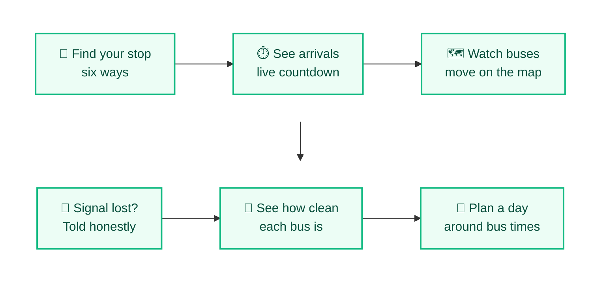
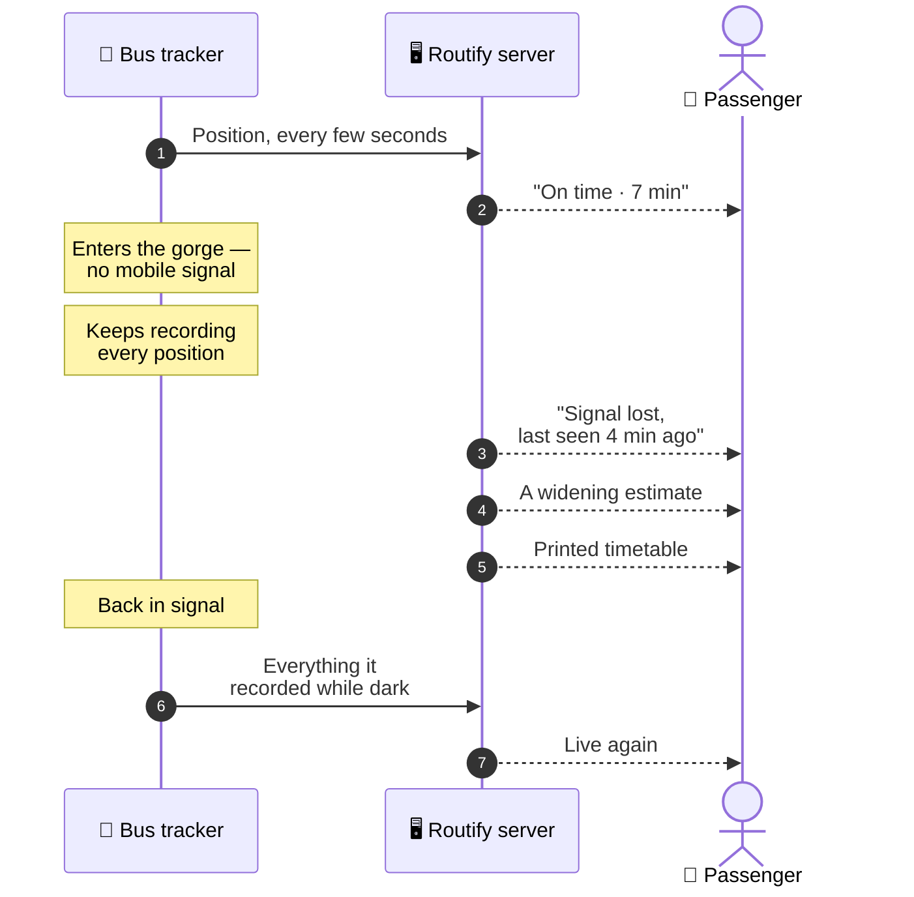
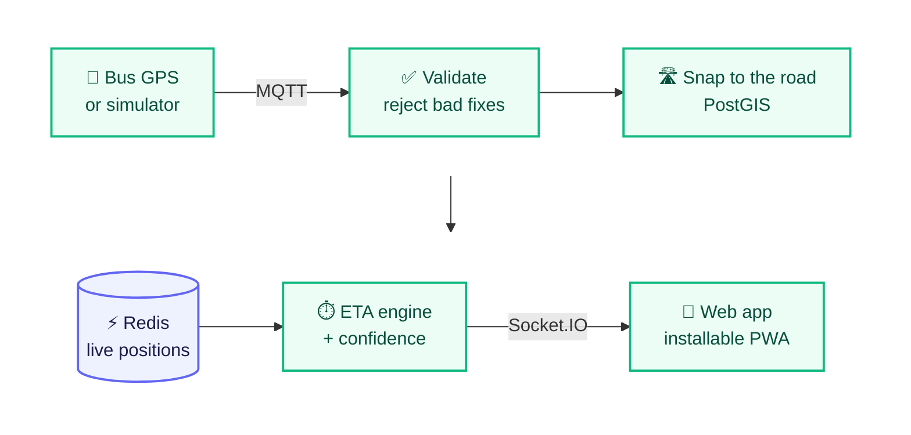
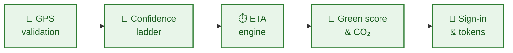

<div align="center">

# 🚌 Routify

### Know where your bus is. Know when it'll reach you. Know how clean it is.

**Smart bus tracking built for Himachal Pradesh — where mountains confuse GPS and the signal vanishes for miles —<br/>so it tells passengers the truth about how sure it is, instead of a frozen dot on a map.**

<br/>

   
<br/>
    

   

</div>

---

## 👋 In 30 seconds

<table>
<tr>
<td width="22%">

😟 **The problem**

</td>
<td>

Waiting at a bus stop in the hills: *has it already left? Is it 5 minutes away or 50?* Mountains block GPS and mobile signal disappears for miles, so ordinary tracking apps freeze the bus icon and let you believe it's live.

</td>
</tr>
<tr>
<td width="22%">

💡 **The idea**

</td>
<td>

Be honest about uncertainty. Arrival times **widen** as the data gets older, a bus that goes quiet is shown as "signal lost", and after 15 minutes the app falls back to the printed timetable. When GPS fails, there are five other ways to find your stop.

</td>
</tr>
<tr>
<td width="22%">

🎯 **Who it's for**

</td>
<td>

Passengers in Himachal, the drivers, and the depots that run the fleet — each with their own screen.

</td>
</tr>
<tr>
<td width="22%">

🚦 **Where it is**

</td>
<td>

Built for **Smart India Hackathon 2026**. The whole system runs, with 17 simulated buses driving 8 real routes — the simulator speaks the same language real vehicle trackers do.

</td>
</tr>
</table>

---

## 🧭 How it works for a passenger



---

## ✨ What it can do

<table>
<tr>
<td width="50%" valign="top">

### ⏱️ Arrival times that tell the truth
Fresh data shows `7 min`. Older data shows `7 min (±2)`, then a range like `8–14 min`. A silent bus becomes *"Signal lost — last seen at Mandi, 4 min ago"*, and after 15 minutes the printed timetable takes over. The rules live in the backend, not just the screen.

</td>
<td width="50%" valign="top">

### 📍 Six ways to find your stop
GPS, stop name, a nearby landmark, a pin on the map, the QR code on the stop's plate, or the bus's route number. Each says how accurate it honestly is — a QR scan is ±5 m — and a GPS fix worse than 500 m is refused rather than trusted.

</td>
</tr>
<tr>
<td valign="top">

### 🌱 A green score you can check
Every bus gets a score from its fuel, emission standard and age, with the weights shown on screen. CO₂ saved is added up from your real trips. Old diesel buses are labelled as such — no greenwashing.

</td>
<td valign="top">

### 🧭 Explore and plan a day
Places worth visiting, each with the bus that gets you there, and a day planner that fits what you like around real bus timings.

</td>
</tr>
<tr>
<td valign="top">

### 🚍 A driver app with one big button
Start and end a trip with no typing, report crowding or delays in one tap, raise a breakdown or an SOS — and the driver's phone doubles as a backup tracker if the GPS box fails.

</td>
<td valign="top">

### 🏢 A depot dashboard, worst first
The live fleet sorted by what needs attention — cancelled, then signal lost, then delayed — plus punctuality per route, service alerts, route import from a spreadsheet and an audit log.

</td>
</tr>
</table>

---

## 📮 A bus through a mountain dead zone



This is the whole point of the project, and you can watch it happen: in the demo, one bus drives into the Pandoh–Aut gorge, where there's genuinely no coverage.

---

## 🏗️ How it's built



| Layer | Tool | Why this one |
|---|---|---|
| 📥 GPS intake | **MQTT** | What real bus trackers speak, and it survives a flaky link far better than repeated web requests |
| 🗄️ Data | **PostgreSQL + PostGIS** | Routes and stops are relational, and "which stops are within 2 km" is a map query |
| ⚡ Live state | **Redis** | Where a bus is *right now* is read constantly and thrown away quickly |
| 📡 Updates | **Socket.IO** | Pushes changes instead of polling, to keep within a tight mobile-data budget |
| 📱 App | **React + Vite, as a PWA** | One link, works on any phone, installs to the home screen and caches for offline |
| ⚙️ Backend | **Node.js + Express + Prisma** | One process today, split cleanly enough to scale out later |

The rules both sides rely on — the green score, the CO₂ factors, the confidence thresholds — live in one shared package, so the server and the app use the **same function** and can never disagree.

---

## 🛡️ Built to be trusted

| | What it means | How it's done |
|---|---|---|
| 📶 | **No false confidence** | The confidence ladder is enforced on the server and pinned by tests, down to the exact minute each label changes. |
| 🧭 | **Bad GPS never reaches the map** | Readings with impossible speeds, swapped coordinates, broken clocks or jitter are rejected, and a dead zone's backlog of late readings is handled without scrambling the timeline. |
| 🔐 | **Sign-in fit for each person** | Passengers use phone + OTP, drivers their employee ID + OTP, depot staff a password. Refresh tokens rotate, and reuse of an old one revokes the whole session. |
| 🚦 | **OTPs can't be abused** | Stored hashed, single-use, limited to 5 guesses, rate-limited per account, and the reply never reveals whether an account exists. |
| 🌐 | **Timetables stay public** | Where buses are and when they arrive needs no login — it's public information. |
| 📋 | **Every privileged action is logged** | Driver and depot actions go to an append-only audit log. |



**90+ automated tests** cover exactly these — and none of them need the database, the cache or the broker, which is why the rules live in plain shared functions. The green-score tests use the specification's own worked examples: a new electric bus scores exactly 100.

---

<a name="roadmap"></a>

## 🗺️ Roadmap

| Status | Milestone |
|:---:|---|
| ✅ | Live tracking with honest, widening arrival estimates and a timetable fallback |
| ✅ | Six ways to find your stop, each with its real accuracy |
| ✅ | Green score, CO₂ saved, places to explore and a day planner |
| ✅ | The driver app and the depot dashboard, with sign-in and an audit log |
| ✅ | A simulator using the same channel as real bus trackers |
| 🔜 | SMS and phone-line access — the replies are designed, the telecom gateway isn't connected |
| 🔜 | Surveyed stop positions from the transport department |
| 🔜 | A native driver app, since a browser can't track GPS with the screen off |

---

## 📁 What's in this repository

```
📦 Routify
├── 📂 api/               backend: GPS pipeline, ETA engine, sign-in, realtime
├── 📂 web/               the app passengers, drivers and depots use
├── 📂 packages/shared/   the rules both sides use, so they can never disagree
├── 📂 infra/             message-broker settings
├── 📄 docker-compose.yml database, cache and message broker
└── 📂 docs/              the full developer guide
```

---

## 👩‍💻 For developers

You need **Node.js** (LTS) and **Docker Desktop**.

```bash
npm install
```

```bash
cp .env.example .env
```

```bash
npm run infra:up
```

Then set up the data, and run the backend, the bus simulator and the app — one per terminal. Every step is in the guide.

**The full developer guide is in [`docs/DEVELOPER-GUIDE.md`](docs/DEVELOPER-GUIDE.md):**

| Topic | Jump to |
|---|---|
| 🚀 Running it, and what to look at first | [Run it yourself](docs/DEVELOPER-GUIDE.md#-run-it-yourself) |
| 🏗️ The architecture, and why each piece | [How it's built](docs/DEVELOPER-GUIDE.md#-how-its-built) |
| 🔐 Sign-in, tokens and the demo accounts | [Signing in](docs/DEVELOPER-GUIDE.md#-signing-in) |
| 🚍 The driver app and depot dashboard | [Driver app & fleet dashboard](docs/DEVELOPER-GUIDE.md#-driver-app--fleet-dashboard) |
| 🧪 What the tests cover | [Tests](docs/DEVELOPER-GUIDE.md#-tests) |

---

<div align="center">

**Built by [Aryan Deshmukh](https://github.com/AryanDeshmukh-2711)** for Smart India Hackathon 2026

</div>
